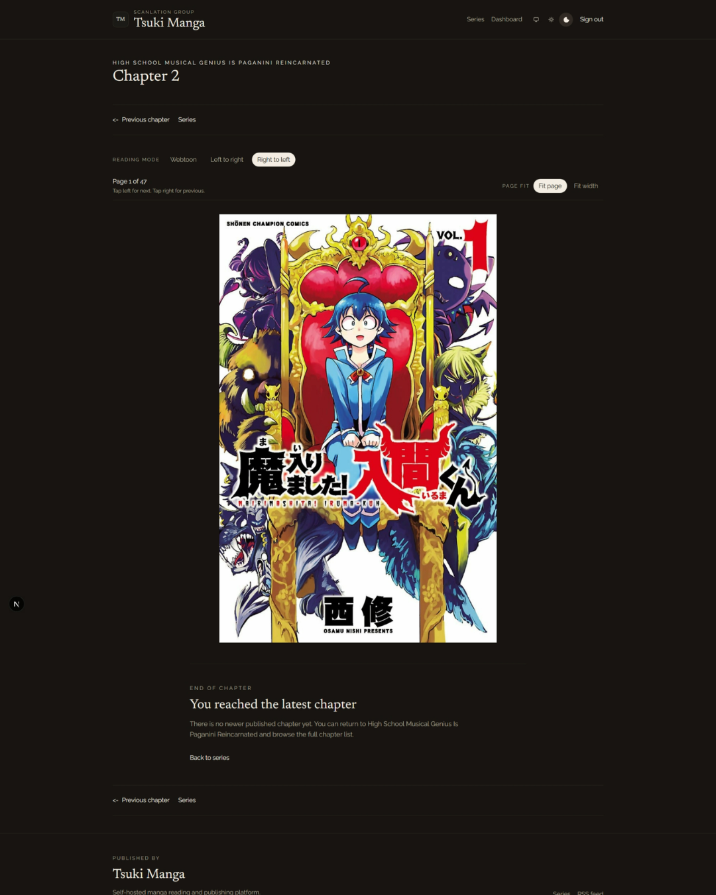
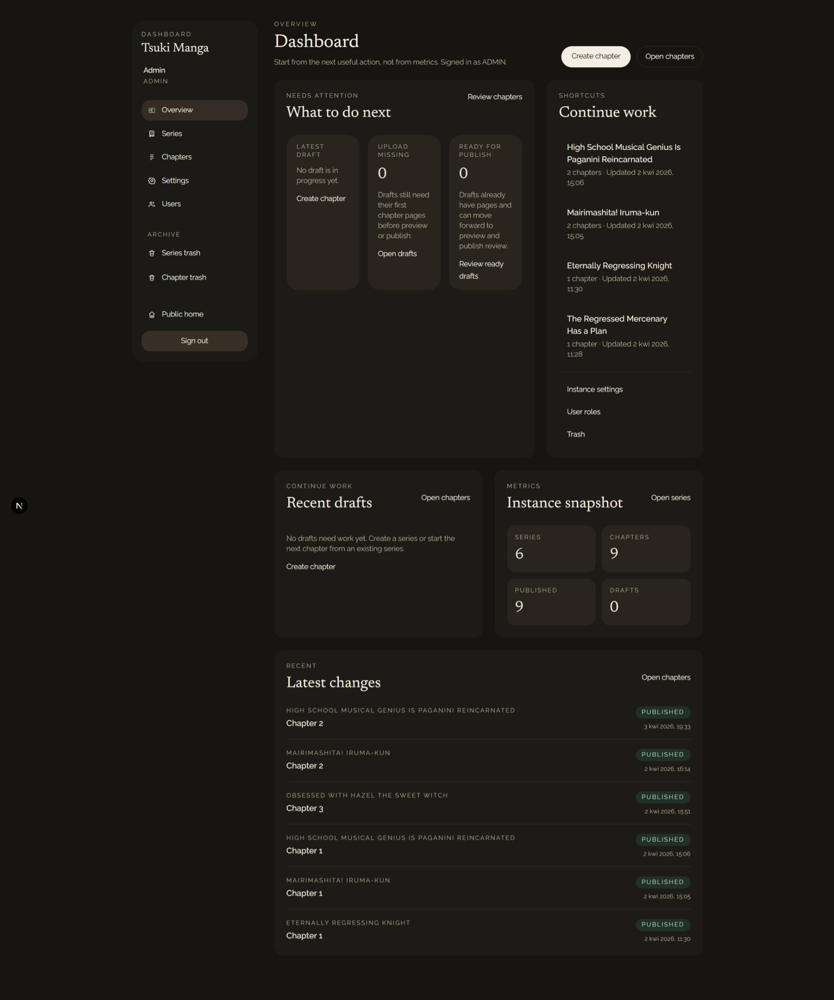

# Tsuki Manga

Self-hosted manga reading and publishing platform for scanlation groups.

<p align="center">
  
</p>

## What It Is

Tsuki Manga is built for one group running one instance.

It combines a calm public reading experience with a focused internal editorial workflow:

- a public site for discovery and reading
- a restrained reader built around manga pages, not chrome
- a dashboard for drafting, uploading, previewing, and publishing chapters
- a self-host-friendly stack with local and `S3-compatible` storage support

The product aims to stay modern, clean, and practical without turning into a generic SaaS admin or an overbuilt publishing system.

## Highlights

- Public manga reader with `Webtoon`, `Left to right`, and `Right to left` reading modes
- Editorial dashboard with a simple `draft -> published` workflow
- Draft preview flow for checking chapters before release
- Local and `S3-compatible` storage behind one storage abstraction
- Docker-first deployment model for self-hosted instances
- Calm editorial UI across the public site, reader, and dashboard

## Product Views

### Public series pages

Series pages stay readable and content-first, with chapter lists as the main action surface.


### Reader

The reader stays visually restrained and page-first, with support for `Webtoon`, `Left to right`, and `Right to left` reading modes.



### Editorial dashboard

The dashboard focuses on real publishing work: series, chapter drafts, page uploads, preview, and release.



## Built For

- Scanlation groups that want one clean, self-hosted home for their releases
- Teams that prefer a simple editorial flow over platform complexity
- Self-hosters who want a modern product without a large operational footprint

## Quick Start

### Local development

```bash
pnpm install
pnpm dev
```

### Production-style local stack

```bash
docker compose up --build
```

The default compose stack now keeps critical data in visible host directories instead of hidden Docker named volumes:

- `./.docker-data/postgres`
- `./public/media`
- `./.storage/draft`
- `./.docker-data/minio` when the optional `minio` profile is enabled

This makes persistence and manual backup much more explicit for self-hosted use.

### Quick backup

```bash
./scripts/backup.sh
```

This creates a compressed backup archive under `./backups/`, includes a PostgreSQL dump, `.env`, and local storage copies, and prunes old archives with a default `14`-day retention.

You can override retention and output location:

```bash
RETENTION_DAYS=30 OUTPUT_ROOT=/srv/tsuki-backups ./scripts/backup.sh
```

### Quick restore

```bash
./scripts/restore.sh ./backups/tsuki-backup-YYYYMMDD-HHMMSS.tar.gz --force
```

To also restore `.env` and start the app after recovery:

```bash
RESTORE_ENV=1 START_APP=1 ./scripts/restore.sh ./backups/tsuki-backup-YYYYMMDD-HHMMSS.tar.gz --force
```

### Useful commands

```bash
pnpm lint
pnpm typecheck
pnpm test
pnpm test:integration
pnpm build
```

## Public content customization

`Tsuki Manga` now includes a simple public content loader with:

- a repo-tracked default file at [`content/site.default.json`](./content/site.default.json)
- an optional local override at `content/site.local.json`

You can customize:

- public community rules shown at `/rules`
- a recruitment announcement shown at `/recruitment`
- the optional recruitment callout on the homepage

The intended workflow for self-hosting is:

- keep `content/site.default.json` in Git as the baseline
- create `content/site.local.json` on your server for instance-specific content
- pull updates without having to stash or move your local public-content changes each time

If `content/site.local.json` exists, the app uses it first. Otherwise it falls back to `content/site.default.json`.

## Documentation

- [Design canon](./docs/design.md)
- [Roadmap review](./docs/status/2026-04-03-roadmap-review.md)
- [Editorial workflow](./docs/features/editorial-workflow.md)
- [Reader experience](./docs/features/reader-experience.md)
- [Deployment runbook](./docs/runbooks/deployment.md)
- [Backup and restore](./docs/runbooks/backup-and-restore.md)
- [Post-deploy sanity check](./docs/runbooks/post-deploy-sanity-check.md)
- [ADR index](./docs/adr/README.md)

## Status

Tsuki Manga is an actively developed, v1-focused product.

The current codebase already includes:

- public discovery pages
- a polished reader
- an editorial dashboard
- operational runbooks for self-hosting

The project is being shaped around a clear constraint set: single-group deployment, simple publishing workflow, restrained UI, and low-friction self-hosting.

## License

This project is licensed under the GNU Affero General Public License v3.0.

See [LICENSE](./LICENSE) for details.
